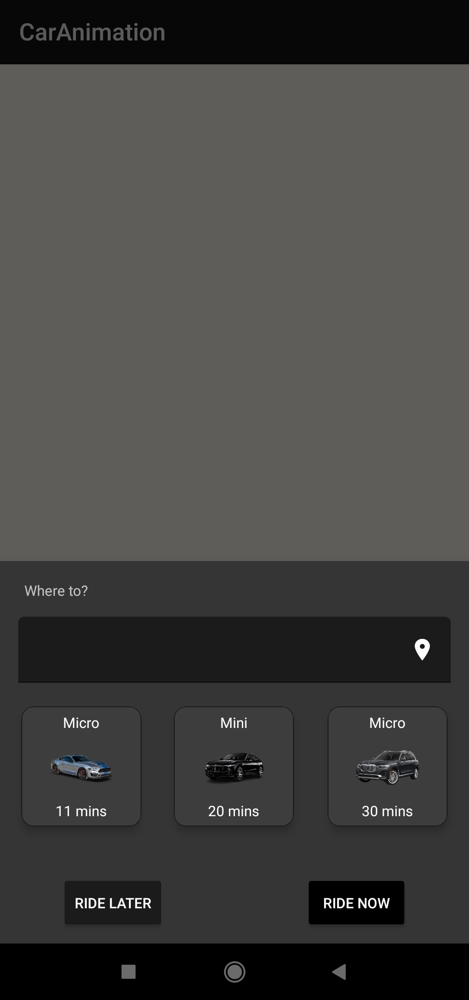
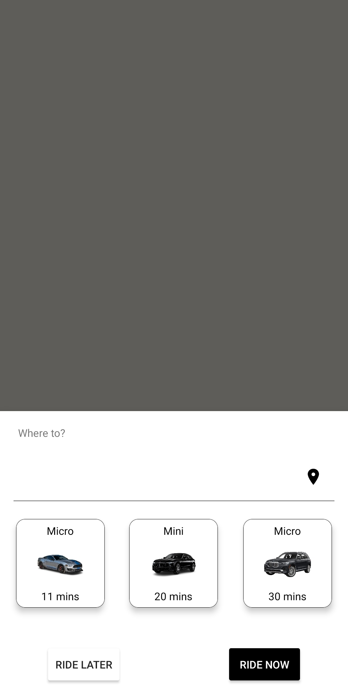

# CarAnimation


This is a test project to practice the implementation of the car animation feature in most ride-sharing/ food delivery apps. 


Slowly building parts of an amazing project...started off with the two location tracker apps...Which can be found on my github


### Simple demo below:


https://user-images.githubusercontent.com/44951692/130448549-f52064fd-7d87-47b5-8102-3a0adec13711.mp4


PS: The location pins are not perfect(may appear to be on buildings etc). This is because I picked the locations from the map.
Ideally, you want to be able to read location at every point as the user/driver in this case uses the root. 


### Future Updates

- Using Firebase to read location
- User to select location and destination


### Progress

##### 1. Adding a bottom sheet dialog to select location and ride

<p align="center">

 
</p>


### Setup

In your manifest file
```kotlin
 <meta-data
            android:name="com.google.android.geo.API_KEY"
            android:value="YOUR_API_KEY_HERE"
            />
            
````

The api-key used above is de-activated. Create one from the google cloud console
